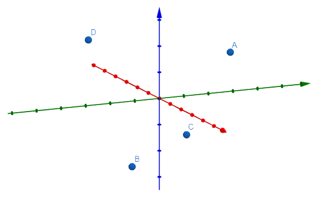

## Tetrahedron method: more accurate or not?

I read the tetrahedron method for calculating the numerical gradient in three dimensions from [this article](https://www.iquilezles.org/www/articles/normalsSDF/normalsSDF.htm) written by Inigo Quilez. The method is based on central difference, but it uses only four samples instead of six.

As its name states, the four samples are the vertices of a tetrahedron centered at the point that the gradient needs to be evaluated. The technique is as following:

$$\nabla f(p)=\begin{pmatrix}\dfrac{\partial f}{\partial x}&\dfrac{\partial f}{\partial y}&\dfrac{\partial f}{\partial z}\end{pmatrix} \approx \dfrac{1}{4h}\begin{bmatrix}1&1&-1&-1\\1&-1&1&-1\\1&-1&-1&1\end{bmatrix}\begin{bmatrix}f(p+(h,h,h))\\f(p+(h,-h,-h))\\f(p+(-h,h,-h))\\f(p+(-h,-h,h))\end{bmatrix}$$

Where $$f$$ is a three-dimensional field that its gradient is to be calculated at $$p$$, and $$h$$ is the differentiation step.

Here is a visual of the four sample points:

To show if this method works, I first see the Taylor expansion of the four sample points, and try to see if the coefficient of its $$f(p)$$ term is $$0$$ and $$f'(p)$$ term is $$1$$.

First see the Taylor expansion of a function in three dimension:

$$f(p+\mathbf{h})=f(p)+\mathbf{h}^T\dfrac{\partial f}{\partial p}+\dfrac{1}{2}\mathbf{h}^T\dfrac{\partial^2 f}{\partial p^2}\mathbf{h}+O(\mathbf{h}^3)$$

A vector of the $$f(p)$$ term of the four sample points would be $$\begin{bmatrix}f(p)&f(p)&f(p)&f(p)\end{bmatrix}^T$$. Obviously:

$$\dfrac{1}{4h}\begin{bmatrix}1&1&-1&-1\\1&-1&1&-1\\1&-1&-1&1\end{bmatrix}\begin{bmatrix}f(p)\\f(p)\\f(p)\\f(p)\end{bmatrix}=\mathbf{0}$$

A vector of the $$f'(p)$$ term of the four sample points would be $$\begin{bmatrix}\mathbf{h}_1&\mathbf{h}_2&\mathbf{h}_3&\mathbf{h}_4\end{bmatrix}^T\nabla p$$. By calculating the following matrix product:

$$\dfrac{1}{4h}\begin{bmatrix}1&1&-1&-1\\1&-1&1&-1\\1&-1&-1&1\end{bmatrix}\begin{bmatrix}h&h&h\\h&-h&-h\\-h&h&-h\\-h&-h&h\end{bmatrix}\nabla p=\dfrac{1}{4h}\begin{bmatrix}4h&0&0\\0&4h&0\\0&0&4h\end{bmatrix}\nabla p=\nabla p$$

And here we shows this method works.

Since the gradient is evaluated at the middle of the sample points, one may intuitive think this method has second order accuracy that its error is $$O(h^2)$$. Is it true? Lets have a look at its second order term.

The second derivative matrix is: $$\dfrac{\partial^2 f}{\partial p^2}=\begin{bmatrix}f''_{xx}&f''_{xy}&f''_{xz}\\f''_{xy}&f''_{yy}&f''_{yz}\\f''_{xz}&f''_{yz}&f''_{zz}\end{bmatrix}$$

Let $$.$$ denote the matrix dot product (or scalar product, sum of product of correstponding elements). For the first sample, the second-order term is:

$$\dfrac{1}{2}\mathbf{h}_1^T\dfrac{\partial^2 f}{\partial p^2}\mathbf{h}_1=\dfrac{1}{2}(\mathbf{h}_1\mathbf{h}_1^T)\cdot\dfrac{\partial^2 f}{\partial p^2}=\dfrac{1}{2}\begin{bmatrix}h\\h\\h\end{bmatrix}\begin{bmatrix}h&h&h\end{bmatrix}\cdot\dfrac{\partial^2 f}{\partial p^2}=\dfrac{h^2}{2}\begin{bmatrix}1&1&1\\1&1&1\\1&1&1\end{bmatrix}\cdot\dfrac{\partial^2 f}{\partial p^2}$$

For the second, third, and fourth samples, the second-order terms are:

$$\dfrac{1}{2}\begin{bmatrix}h\\-h\\-h\end{bmatrix}\begin{bmatrix}h&-h&-h\end{bmatrix}\cdot\dfrac{\partial^2 f}{\partial p^2}=\dfrac{h^2}{2}\begin{bmatrix}1&-1&-1\\-1&1&1\\-1&1&1\end{bmatrix}\cdot\dfrac{\partial^2 f}{\partial p^2}$$

$$\dfrac{1}{2}\begin{bmatrix}-h\\h\\-h\end{bmatrix}\begin{bmatrix}-h&h&-h\end{bmatrix}\cdot\dfrac{\partial^2 f}{\partial p^2}=\dfrac{h^2}{2}\begin{bmatrix}1&-1&1\\-1&1&-1\\1&-1&1\end{bmatrix}\cdot\dfrac{\partial^2 f}{\partial p^2}$$

$$\dfrac{1}{2}\begin{bmatrix}-h\\-h\\h\end{bmatrix}\begin{bmatrix}-h&-h&h\end{bmatrix}\cdot\dfrac{\partial^2 f}{\partial p^2}=\dfrac{h^2}{2}\begin{bmatrix}1&1&-1\\1&1&-1\\-1&-1&1\end{bmatrix}\cdot\dfrac{\partial^2 f}{\partial p^2}$$

The first ($$x$$) component of the second-order error vector is:

$$\dfrac{1}{4h}\dfrac{h^2}{2}\cdot\dfrac{\partial^2 f}{\partial p^2}\cdot\left(\begin{bmatrix}1&1&1\\1&1&1\\1&1&1\end{bmatrix}+\begin{bmatrix}1&-1&-1\\-1&1&1\\-1&1&1\end{bmatrix}-\begin{bmatrix}1&-1&1\\-1&1&-1\\1&-1&1\end{bmatrix}-\begin{bmatrix}1&1&-1\\1&1&-1\\-1&-1&1\end{bmatrix}\right)=\dfrac{h}{8}\cdot\dfrac{\partial^2 f}{\partial p^2}\cdot\begin{bmatrix}0&0&0\\0&0&4\\0&4&0\end{bmatrix}=f''_{yz}$$

Wait, the second order error is not zero! Its $$x$$-component is $$\dfrac{\partial^2 f}{\partial y \partial z}$$. One my guess, is its $$y$$-component $$\dfrac{\partial^2 f}{\partial x \partial z}$$ and $$z$$-component $$\dfrac{\partial^2 f}{\partial x \partial y}$$?

$$\dfrac{h}{8}\cdot\dfrac{\partial^2 f}{\partial p^2}\cdot\left(\begin{bmatrix}1&1&1\\1&1&1\\1&1&1\end{bmatrix}-\begin{bmatrix}1&-1&-1\\-1&1&1\\-1&1&1\end{bmatrix}+\begin{bmatrix}1&-1&1\\-1&1&-1\\1&-1&1\end{bmatrix}-\begin{bmatrix}1&1&-1\\1&1&-1\\-1&-1&1\end{bmatrix}\right)=\dfrac{h}{8}\cdot\dfrac{\partial^2 f}{\partial p^2}\cdot\begin{bmatrix}0&0&4\\0&0&0\\4&0&0\end{bmatrix}=f''_{xz}$$

$$\dfrac{h}{8}\cdot\dfrac{\partial^2 f}{\partial p^2}\cdot\left(\begin{bmatrix}1&1&1\\1&1&1\\1&1&1\end{bmatrix}-\begin{bmatrix}1&-1&-1\\-1&1&1\\-1&1&1\end{bmatrix}-\begin{bmatrix}1&-1&1\\-1&1&-1\\1&-1&1\end{bmatrix}+\begin{bmatrix}1&1&-1\\1&1&-1\\-1&-1&1\end{bmatrix}\right)=\dfrac{h}{8}\cdot\dfrac{\partial^2 f}{\partial p^2}\cdot\begin{bmatrix}0&4&0\\4&0&0\\0&0&0\end{bmatrix}=f''_{xy}$$

The answer is yes. Which means, the tetrahedron method does not have a second-order accuracy. Its error is approximately $$h\begin{pmatrix}\dfrac{\partial^2 f}{\partial y \partial z},\dfrac{\partial^2 f}{\partial x \partial z},\dfrac{\partial^2 f}{\partial x \partial y}\end{pmatrix}$$, which is proportional to $$h$$.

The tetrahedron method and forward differentiation have the same order of accuracy. The tetrahedron method needs four samples, while forward differentiation only require three samples if the point is already evaluated. But why is the tetrahedron method still widely used in computer graphics? In most cases, the tetrahedron method produces a better visual result than forward differentiation. I guess it's because forward differentiation has a shift like it is actually calculating the derivative at the middle of the four samples, while the tetrahedron method does not. Also, for a sphere-shaped scalar field, the off-diagonal terms of the Hessian matrix is almost zero, it is more accurate to eliminate the diagonal terms that involves higher error.

A comparison of forward differentiation (2nd from the left), central difference (3rd), and tetrahedron method (last) is followed:

<iframe width="640" height="360" frameborder="0" src="https://www.shadertoy.com/embed/3lfyDl?gui=true&t=0&paused=true&muted=true" allowfullscreen></iframe>

This demo compares numerical gradient with analytical gradient. Red color indicates the error in the direction of gradient, and blue color indicates the error in the magnitude of gradient. A higher color saturation indicates a higher error. Drag mouse up to increase numerical differentiation step $$h$$ and down to decrease $$h$$.
