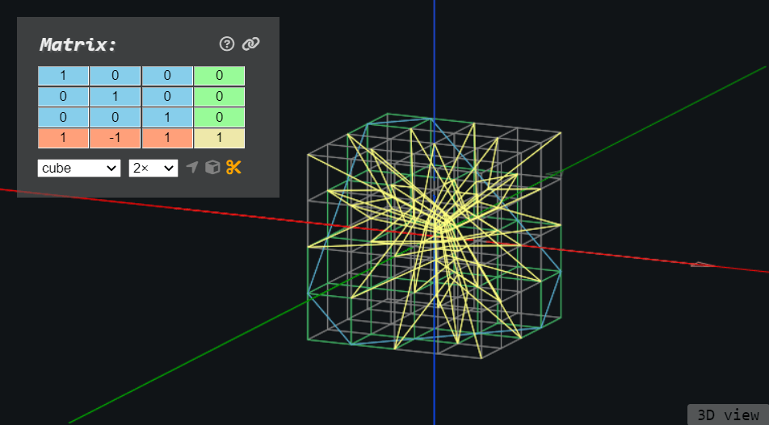
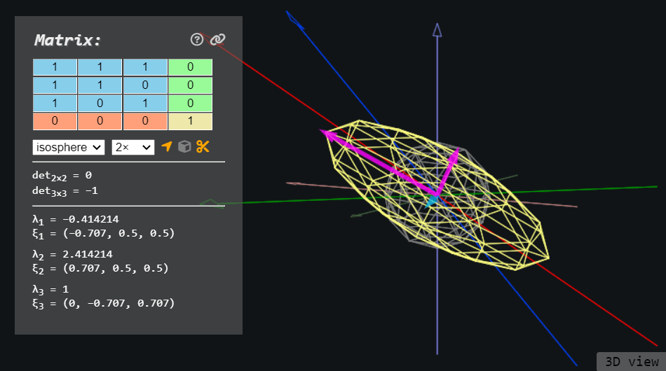
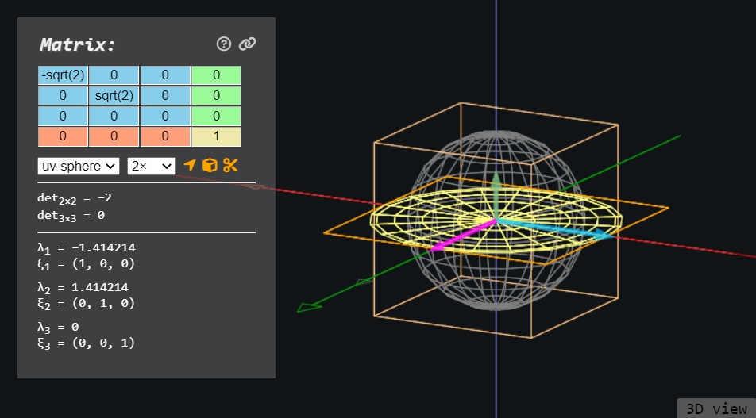

# Simple 3D Matrix Visualizer

By Harry Chen - I created this tool in 2019 when I just started learning computer graphics. It seems to have become the main source of my site's traffic so I write this readme to answer some questions that users might have.

## Matrix

This tool visualizes a 4×4 [affine matrix](https://en.wikipedia.org/wiki/Transformation_matrix#Affine_transformations) applied to R3. The transformation is equivalent to the matrix applied to the left of a column vector. The blue block is the geometry, the green column is the translation, the red row is the perspective, and the yellow number at the bottom right controls the scaling. If you are not a fan of computer graphics and are only interested in matrices in grade-school math, you can ignore the additional dimension and only play with the blue 3×3 matrix.

You may be surprised that you can enter expressions like `sqrt(2)` and `sin(pi/3)` as matrix components, which is powered by [math.js](https://mathjs.org/). Note your input for matrix components must be real numbers.

## Visualization

There are several built-in 3D models to apply transformation to:
 - Cube: a 4x4 voxel grid
 - UV sphere: similar to globe sphere, with longitudes and latitudes
 - isosphere: a sphere almost unchanged after rotation, useful for visualizing symmetric matrices with eigenvectors
 - torus: a model symmetrical about the *z*-axis
 - [bunny](https://en.wikipedia.org/wiki/Stanford_bunny): an asymmetrical model
 - [monkey](https://docs.blender.org/manual/en/latest/modeling/meshes/primitives.html#monkey): a model symmetrical about the *yOz*-plane

The dimed axes and model are untransformed and the ones with a higher contrast are with the matrix applied. The `n×` (default `2×`) checkbox controls the size of the model: if you choose `2×`, the coordinates of the bounding cube vertices will be ±2, etc. The bounding cube is displayed by default and can be hidden/shown by clicking the  icon.

You can click the "3D view" button on the bottom right to limit the viewport to 2D and click it again to go back to 3D.

## Eigenpairs

I find it intuitive to add determinants and eigenpairs to this visualizer. The 2×2 determinant corresponds to the matrix in the top left block and the 4×4 determinant only shows up if you modify numbers outside the blue block. This tool calculates and visualizes the 3×3 eigenpairs by default, but it can also calculate the 4×4 eigenpairs if you change the additional dimension.

Eigenvectors are plotted with the same magnitude as the corresponding eigenvalue multiplied by the model size. A magenta arrow is for a positive eigenvalue and a blue arrow is for a negative one. Zero eigenvectors are in green with a nonzero length. Note that eigenpairs are computed numerically and are not always reliable.

Eigenpairs can be toggled on/off with the  button.

## Perspective clipping

A large perspective can result in infinitely long lines in the transformed model. Enabling  culls infinitely long lines and highlights them in green in the untransformed model. It also displays a blue plane of points being transformed to infinity.

## Shareable link

A shareable link can be copied by clicking the  button. You may need to allow clipboard access in your browser for it to work.

## Import matrix

You may find you need to visualize matrices generated by a program. To import a matrix, press `F2` or `Ctrl+M` and paste the matrix into the pop-up. Supported matrix formats include the Python format like `[[1, 2, 3], [4, 5, 6], [7, 8, 9]]`, the MATLAB format like `[1,2,3; 4,5,6; 7,8,9]`, and the Wolfram format like `{ {1, 2, 3}, {4, 5, 6}, {7, 8, 9} }`. The tool will try to parse other formats or a mix of these formats, but in that case, I can't guarantee you will get what you intended.

## Screenshots

,0,0;0,sqrt(2),0;0,0,0&g=uv-sphere&s=2)

## Self-promotion

If you find this tool helpful, make sure you check my other stuff like the [3D implicit surface grapher](https://harry7557558.github.io/spirulae/implicit3/), the [complex domain coloring grapher](https://harry7557558.github.io/spirulae/complex/), and my [Desmos](https://harry7557558.github.io/desmos/index.html) and [Shadertoy](https://harry7557558.github.io/shadertoy/index.html) pages. You are free to share my tools with others via URLs. If you found a bug or have a feature request, don't hesitate to submit an issue/PR on GitHub.
